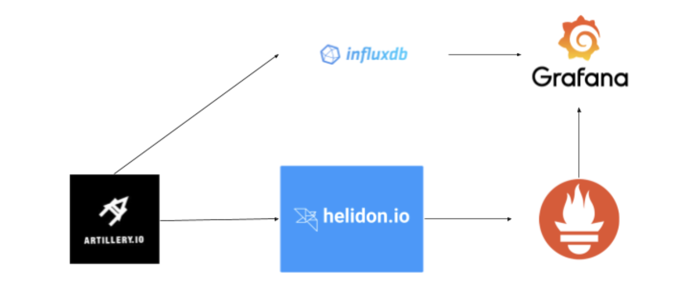
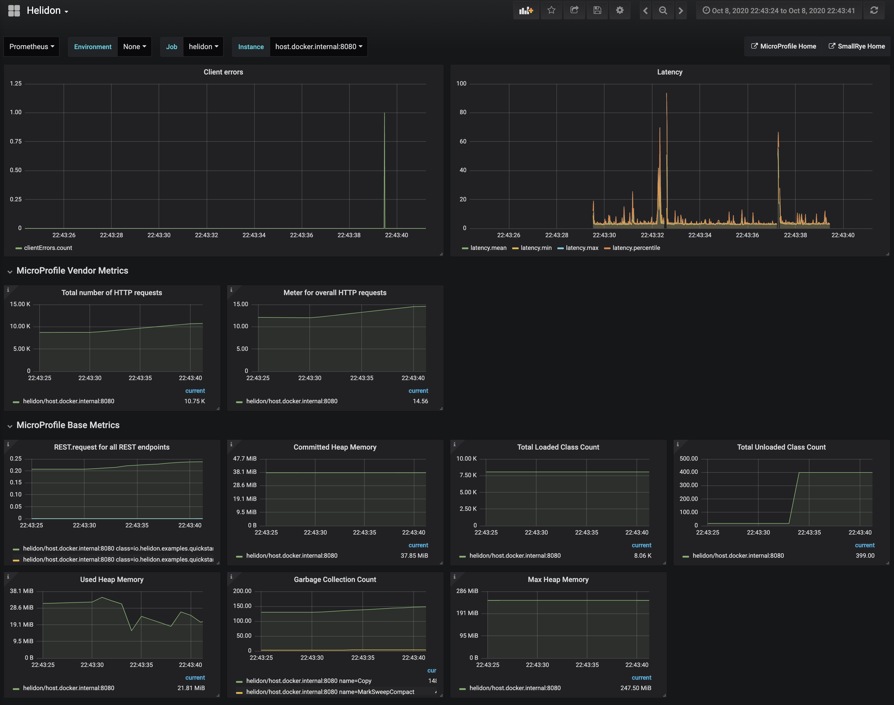
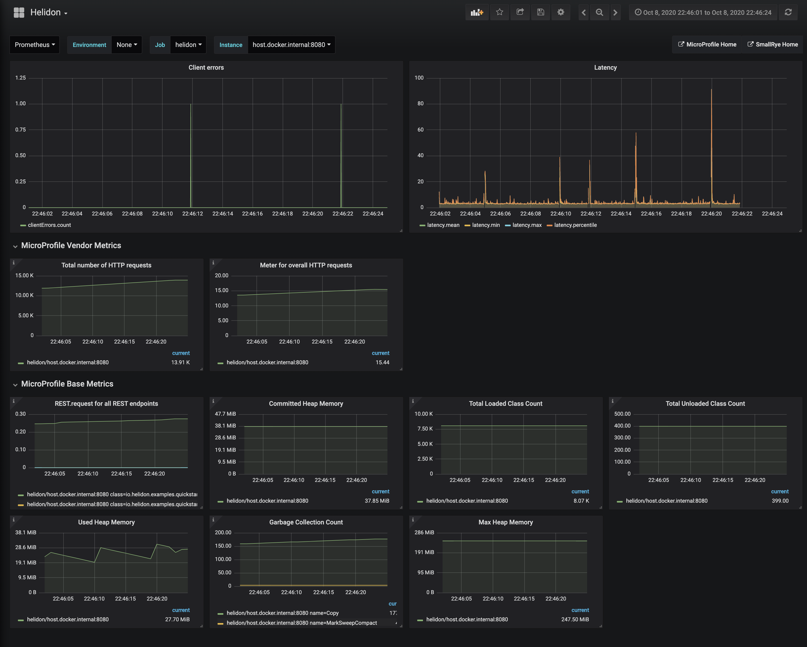
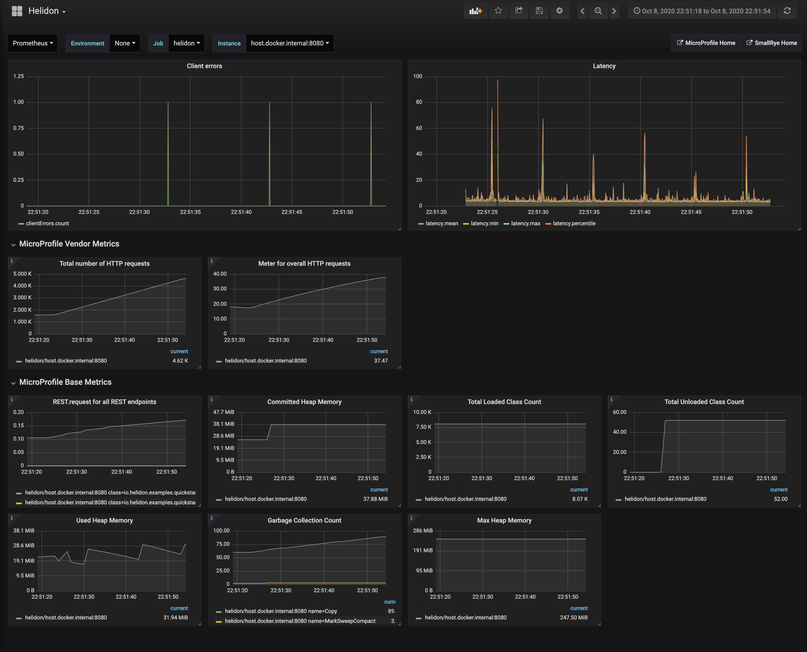
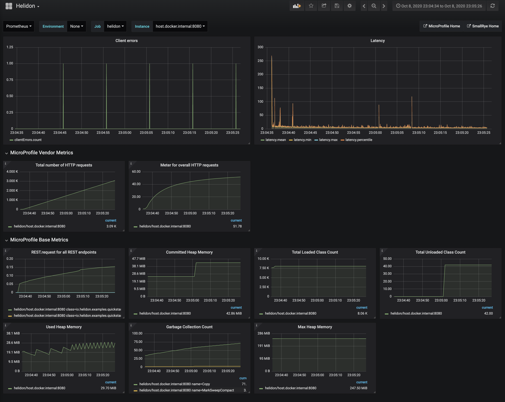

# Helidon

This repository aims to analyse Helidon framework as an option for Java web microservices.

## Testing

The simplest version of a Helidon service was built and only one endpoint was stressed in order to hit the service limit.

```
curl -X GET http://localhost:8080/greet
{"message":"Hello World!"}
```

There is no database connection, no integration to different services through HTTP or any other protocol. Besides, everything was executed locally.

A docker image was created and a container with 1024mb of memory was initialized. 

```
docker run -d -p 8080:8080 --memory="1024m" --network ece2b6cf70d7 helidon
```

The following image shows how the loading test was executed:




The tests were like:

1. For 10 seconds
* 50 requests, total of 500 requests and so on
* 100 requests
* 200 requests

2. For 20 seconds
* 50 requests, total of 1k requests and so on
* 100 requests
* 200 requests

3. For 30 seconds
* 50 requests, total of 1.5k requests and so on
* 100 requests
* 200 requests

4. For 60 seconds
* 50 requests, total of 3k requests and so on
* 100 requests
* 200 requests


The results were:

| Requests/Second | 10            | 20    | 30    | 60    |
| -------------   |:-------------:| -----:|------:|------:|
| 50              | OK | OK | OK | OK |
| 100             | OK |   OK | OK | FAIL |
| 200             | OK |    FAIL | FAIL | FAIL |


For 60 seconds the best it got was 60 requests.

In all tests, the memory and latency kept pretty steady. One thing that happened was that the GC seemed a little bit busier overall.

The following images show couple graphs. One can find all graphs in the tests folder.

* 2k requests in 10 seconds



* 2k requests in 20 seconds


* 3k requests in 30 seconds


* 3.6k requests in 60 seconds



## Pros
* Native image to run in GraalVM
* It's built by modules so that we can add only what is needed. Among other modules, security, JPA, JWT Auth.
* It provides development experience familiar to Java EE/Jakarta EE developers.
* Start-up in few miliseconds

## Cons

* StackOverFlow indice: on Oct 9th, only 81 at this moment. As comparison, 92,278 spring-boot questions.
* Little content on the internet overall
* It was not found a community really excited about it

## Curiosities

* It's made by Oracle

## Conclusion

When it comes to performance, it was easy to hit the service limit. One might say the test could have tweaked here and there in order to improve the results. I could not agree more. I do believe that if it was tuned a bit, the results could achieve better limits.

However when Helidon is compared to its competitors, it basically is defeated. Look at this [article](https://medium.com/better-programming/which-java-microservice-framework-should-you-choose-in-2020-4e306a478e58).

On top of that, the project is not so well-known in the community.

Therefore, by choosing Helidon, we would end up having the same problem: a too young framework that can be the hype in few months or years, but definitely it's not today. It would be a bet.


## References:
* [Helidon documentation](https://helidon.io/docs/latest/#/mp/introduction/01_introduction)
* [Helidon medium](https://medium.com/helidon)
* [Which Java Microservice Framework Should You Choose in 2020?](https://medium.com/better-programming/which-java-microservice-framework-should-you-choose-in-2020-4e306a478e58)
* [Helidon YouTube channel](https://www.youtube.com/channel/UChg00-uTTrCMmPsuzUNaZsA)